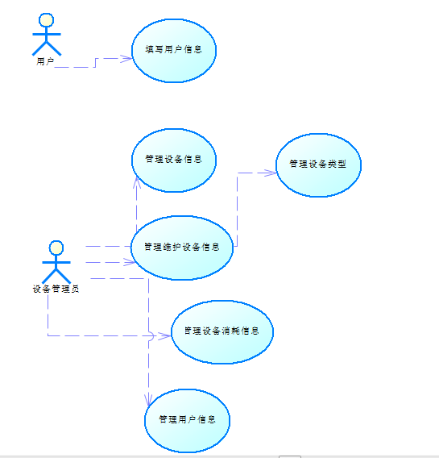

# 用例描述和用例图

用例名称：用户信息注册和登陆
简要说明：用户注册账号添加个人信息并完成登陆
参与者：用户
前置条件：用户尚未登陆网站
后置条件：用户已完成注册并登陆网站
基本事件流：用户打开网站登陆页面，点击注册，输入用户名、用户编号和密码即可完成注册；用户点击登陆，输入正确的用户名和密码，进入网站。
附加流：用户注册失败时提醒错误信息并刷新注册页面。

用例名称：设备基础信息管理
简要说明：设备管理员对可以新建、修改和删除设备信息，并且通过设备的属性字段对设备进行查询。
参与者：设备管理员
前置条件：设备管理员已登陆，且有新的设备信息需要更改或查询
基本事件流：设备管理员登陆网站后台页面，将需要更改的设备信息输入到数据库中，点击确定并保存；设备管理员在需要对设备进行查询时，输入搜索条件进行搜索，对查询到的信息进行确定。
后置条件：用户管理员完成信息的更改或查询
附加流：修改或查询信息失败后提示错误信息

用例名称：设备维护信息管理
简要说明：设备管理员对可以新建、修改和删除设备维护信息，并且通过设备的属性字段对设备维护信息进行查询。
参与者：设备管理员
前置条件：设备管理员已登陆，且有新的设备维护信息需要更改或查询
基本事件流：设备管理员登陆网站后台页面，将需要更改的设备维护信息输入到数据库中，点击确定并保存；设备管理员在需要对设备维护信息进行查询时，输入搜索条件进行搜索，对查询到的设备维护信息进行确定。
后置条件：用户管理员完成设备维护信息的更改或查询
附加流：修改或查询设备维护信息失败后提示错误信息

用例名称：设备消耗信息管理
简要说明：设备管理员对可以新建、修改和删除设备消耗信息，并且通过设备的属性字段对设备消耗信息进行查询。
参与者：设备管理员
前置条件：设备管理员已登陆，且有新的设备消耗信息需要更改或查询
基本事件流：设备管理员登陆网站后台页面，将需要更改的设备消耗信息输入到数据库中，点击确定并保存；设备管理员在需要对设备消耗信息进行查询时，输入搜索条件进行搜索，对查询到的设备消耗信息进行确定。
后置条件：用户管理员完成设备消耗信息的更改或查询
附加流：修改或查询设备消耗信息失败后提示错误信息

